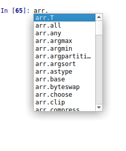
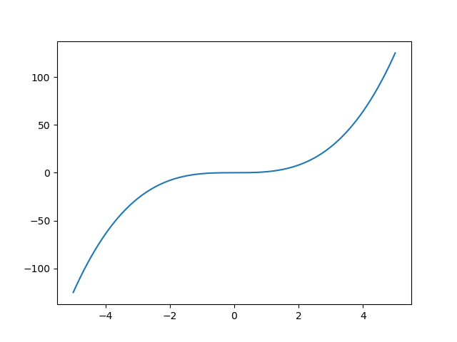

# NumPy basics

[NumPy](https://numpy.org/) is a Python module, developed to simplify
scientific computations. It is part of [SciPy stack](https://www.scipy.org), which provides
wide variety of routines for linear algebra, Fourier tranformation,
optimization, statistics, etc. It brings the power of mathematical software
like MATLAB and beyond, combines it with flexibility and convinience of Python 
and is available under open-source license. These factors make SciPy a perfect
choice for educational and academic computations.

## Module

Python allows code structuring by packaging the files into modules.
Modules need to be installed prior to use. The most convinient way to
do it is to use PIP, the Python package manager:

	pip install <package_name>

E.g. to install NumPy

	pip install numpy

In case Spyder is used, NumPy, SciPy should be already installed.

## NumPy array

The data structure, which is in the heart of the whole SciPy ecosystem.
It is an array of the data of same type. To create such array:

```python
import numpy as np # load the NumPy module and give it alias np
arr = np.array([0, 1, 2, 3, 4])
print(arr)
```

	[0 1 2 3 4]

Despite array looks same as Python list, it provides lots of useful methods.
To see them, in IPython console type the name of array, add dot and press tab.
The pop-up with the list of methods should occur:



Full list of methods is available in the [official documentation](https://docs.scipy.org/doc/numpy/reference/generated/numpy.ndarray.html)

A few examples:

	In [65]: arr.mean()
	Out[65]: 2.0

	In [66]: arr.sum()
	Out[66]: 10

	In [67]: arr.var()
	Out[67]: 2.0

	In [68]: arr.prod()
	Out[68]: 0

One of the most widely used features is paralell computation, i.e.
application of function to the array will lead to application of it
to every element of an array. In the previous chapter it was shown how 
to calculate squares of the array:
```python
for elem in lst1:
    print(elem**2)
```

The same problem in NumPy could be solved in a very elegant way:

	In [71]: np.power(arr, 2)
	Out[71]: array([ 0,  1,  4,  9, 16])

(Here np.power is a function, which raises the input to the given power)
Or even simplier:

	In [72]: arr**2
	Out[72]: array([ 0,  1,  4,  9, 16])

This is a typical way to plot a function in Python:

```python
import numpy as np # load the NumPy module and give it alias np
import matplotlib.pyplot as plt # load pyplot submodule and give it alias plt

x = np.linspace(-5, 5, 1000) # create array of 1000 points, equally spaced in the range [-5, 5]
y = np.power(x, 3) # apply the function to the array to get y values

plt.plot(x, y) # plot x, y pairs
plt.show() # show the plot
```

This code will produce following image:



NumPy arrays are not limited to 1D case. They could have arbitrary dimensionality,
such as matrices:
```python
A = np.array([[1, 0, 0],
              [0, 1, 0],
              [0, 0, 2]])
```

The size of matrix could be obtained with *shape* method:

	In [9]: A.shape
	Out[9]: (3, 3)

The linear algebra routines could be used for matrix multiplication:
```python
A = np.array([[1, 0, 0],
              [0, 1, 0],
              [0, 0, 2]])

b = np.array([1, 1, 1])
print(np.dot(A, b)) # dot product A*b
```

	[1 1 2]

inversion:

```python
In [24]: np.linalg.inv(A)
Out[24]: 
array([[1. , 0. , 0. ],
       [0. , 1. , 0. ],
       [0. , 0. , 0.5]])
```

Or to solve system of linear equations:

```python
res = np.linalg.solve(A, b) # solve system of linear equations A*x = b
print("Solution:", res) # x
print("Verification:", A@res) # @ is a dot product operator
```

	Solution: [1.  1.  0.5]
	Verification: [1. 1. 1.]


NumPy array has unusually powerful indexing system:

```python
A = np.array([[1, 2, 3],
              [4, 5, 6],
              [7, 8, 9]])
```

	In[5]: A[0,1] # first row, second column
	Out[5]: 2

	In [6]: A[:,1] # all rows, second column
	Out[6]: array([2, 5, 8])

	In [7]: A[2,:] # third row, all columns
	Out[7]: array([7, 8, 9])

	In [8]: A[0:2,0:2] # rows from first to third, columns from first to third
	Out[8]: 
	array([[1, 2],
	       [4, 5]])

	In [11]: mask = [True, False, True] # create boolean mask

	In [12]: A[mask,:] # take rows according to mask, all columns
	Out[12]: 
	array([[1, 2, 3],
	       [7, 8, 9]])

Overall, it is difficult to say which functionality is important for chemist
and which does not. In any case, reading documentation might be a good idea.
Also, Python has a developed community, and almost any question can
be answered by simple searching for it in the web.